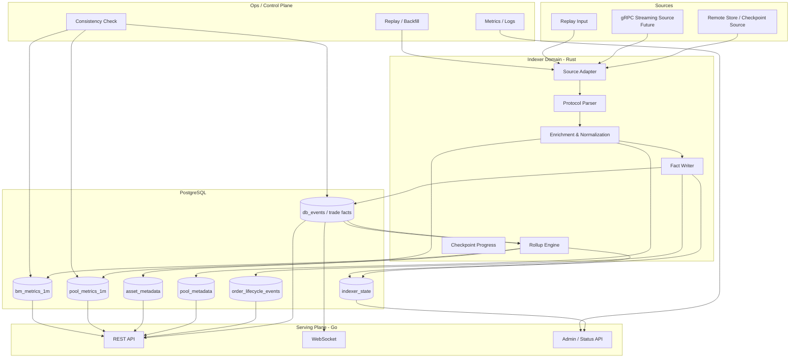
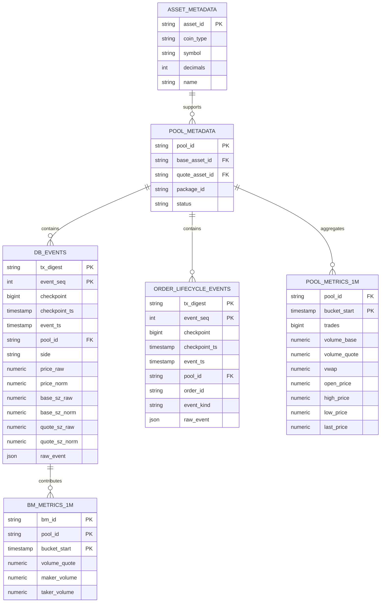
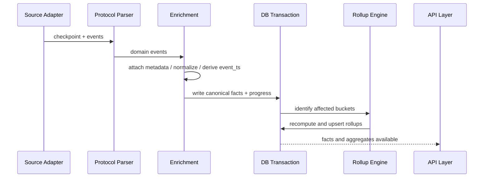

# DeepBook Data Infrastructure Architecture V2

- Status: Proposed
- Last Updated: 2026-03-19
- Related Docs:
  - `docs/PRODUCT_PRD.md`
  - `docs/FEATURE_BACKLOG.md`
  - `docs/DATA_CONTRACT.md`

## 1. Design Goals

本设计文档的目标是：
- 在不做大爆炸重写的前提下，给 `sui-deepbook-indexer` 一个可渐进落地的 V2 架构
- 明确服务边界、模块职责、数据分层和后续扩展方式
- 让当前项目从“能跑的索引器”升级成“可复用的数据基础设施”

---

## 2. Current Architecture Summary

当前系统由三部分组成：
- Rust indexer：抓取 Sui checkpoint 并解析 DeepBook 事件
- PostgreSQL：存事实表与 1 分钟聚合表
- Go API：提供 REST 与 WebSocket

这个基础方向是对的，但存在几个结构性问题：
- 配置、文档、实现不完全一致
- ingestion / parsing / enrichment / rollup 边界还不够清晰
- metadata 与 normalization 还没有独立能力层
- replay / consistency check 还没有成为清晰的 control plane
- 对外 API 更偏“已有结果暴露”，还不是 builder-first contract

---

## 3. Design Principles

### 3.1 Facts First
先把事实层建稳，再做衍生层。所有 rollup、ranking、analytics 都必须可以从事实层重建。

### 3.2 Raw and Normalized Coexist
既保留链上原始数值，也提供人类可消费的标准化数值，避免信息损失与重复转换。

### 3.3 Separate Event Time from Checkpoint Time
`event_ts`、`checkpoint_ts`、`ingested_at` 必须分离，避免时间语义污染。

### 3.4 Metadata-driven Design
asset / pool metadata 必须成为一等能力，而不是零散辅助逻辑。

### 3.5 Incremental Refactor, Not Rewrite
优先在现有目录结构上演进，避免为了“架构漂亮”做高成本重写。

### 3.6 Serving Plane and Control Plane Separation
查询服务与运维能力分开建模，方便后续扩展 admin / replay / health / lag。

---

## 4. Target Architecture

---

## 5. Logical Layers

### 5.1 Source Adapter Layer
职责：
- 对接 Remote Store / gRPC / replay input
- 统一产出 checkpoint / event 流
- 处理 source 失败重试与 source health

建议：
- V2 仍以 Remote Store 为默认数据源
- 保留未来接 gRPC streaming 的接口抽象

### 5.2 Protocol Parser Layer
职责：
- 解析 DeepBook 事件结构
- 把链上 event 映射为内部 domain event
- 对不同 package version 做兼容

建议：
- 把 DeepBook 事件解析集中在独立模块，而不是散在主流程里
- 所有支持事件类型形成显式 registry

### 5.3 Enrichment / Normalization Layer
职责：
- 补充 pool / asset metadata
- 生成 normalized values
- 拆出 `event_ts` / `checkpoint_ts`
- 标准化 side、maker/taker 归因等字段

### 5.4 Fact Writer Layer
职责：
- 幂等写入 canonical facts
- 原子写入 raw_event、normalized fields、index progress
- 为 replay / correction 提供稳定事实基础

### 5.5 Rollup Engine Layer
职责：
- 计算 1m 聚合
- 支持局部 bucket 重算
- 为 ranking / execution summary 等高层能力提供数据底座

### 5.6 Serving Layer
职责：
- 提供 REST / WS 查询
- 封装 builder-facing contract
- 统一 auth、cursor、错误格式、pagination

### 5.7 Control Plane
职责：
- replay
- backfill
- consistency check
- lag / health / metrics
- source / DB 状态暴露

---

## 6. Incremental Module Plan

### 6.1 Rust Side

建议保留现有 workspace，不做大规模目录搬迁；先按职责收敛模块边界：

- `indexer/src/config.rs`
  - 收口配置源，统一 testnet/mainnet/source 配置
- `indexer/src/remote_store.rs`
  - 演进为 source adapter 的默认实现
- `indexer/src/events.rs`
  - 演进为 protocol parser + event mapping 核心
- `indexer/src/main.rs`
  - 逐步减薄，保留 orchestration 逻辑
- `storage/`
  - 承担 schema / query / model 定义
- `common/`
  - 存放共享类型、配置结构、公共枚举

如果后续继续演进，可再抽出：
- `indexer/src/enrichment/`
- `indexer/src/rollup/`
- `indexer/src/source/`
- `indexer/src/replay/`

### 6.2 Go Side

建议形成更清晰的模块职责：
- `api-go/internal/config`
- `api-go/internal/store`
- `api-go/internal/handlers`
- `api-go/internal/ws`
- `api-go/internal/middleware`
- `api-go/internal/admin`

当前不需要重写成复杂框架，但需要把：
- 对外 contract
- cursor 规范
- auth 逻辑
- status / admin 能力

从普通 handler 里逐步收敛出来。

---

## 7. Data Model Evolution

## 7.1 Design Strategy

V2 不建议一开始就彻底推翻现有表，而是采用：
- **保留已有核心表**
- **补齐缺失列 / 衍生表**
- **逐步把“单一成交事件索引器”扩展为“多事实层服务”**

## 7.2 Recommended Core Tables

### A. `db_events`
短期继续作为 canonical trade fact 表使用，但字段语义需要升级：
- raw values
- normalized values
- `checkpoint_ts`
- `event_ts`
- `raw_event`
- package / module / event type

### B. `order_lifecycle_events`
用于存：
- order_placed
- order_modified
- order_canceled
- order_expired

### C. `asset_metadata`
用于存：
- asset_id / coin_type
- symbol
- decimals
- name
- status / source

### D. `pool_metadata`
用于存：
- pool_id
- base_asset_id
- quote_asset_id
- fee / tick / pool status（按可获取程度补齐）

### E. Rollup Tables
- `pool_metrics_1m`
- `bm_metrics_1m`
- 后续可扩展 `pool_rankings_*` / `execution_summary_*`

### F. Control Tables
- `indexer_state`
- 可选：`replay_runs` / `consistency_reports`

---

## 8. Suggested ER Diagram

---

## 9. End-to-end Flow

关键要求：
- 同一个 checkpoint 的 facts、rollups、progress update 必须处于同一事务边界内
- replay 走相同的数据模型与 rollup 路径，避免“在线路径”和“回放路径”逻辑分叉

---

## 10. API Surface Recommendations

### 10.1 Public REST

建议收敛为以下能力集合：
- `GET /health`
- `GET /status`
- `GET /v1/deepbook/pools/:pool_id/metrics`
- `GET /v1/deepbook/pools/:pool_id/candles`
- `GET /v1/deepbook/pools/:pool_id/execution/fills`
- `GET /v1/deepbook/pools/:pool_id/execution/lifecycle`
- `GET /v1/deepbook/pools/:pool_id/execution/summary`
- `GET /v1/deepbook/pools/rankings`
- `GET /v1/deepbook/assets`
- `GET /v1/deepbook/pools`

### 10.2 WebSocket

建议 WS 的 v2 contract 统一包含：
- snapshot + live stream 行为定义
- cursor / resume 语义
- pool filter
- event type filter
- auth 行为
- error event 格式

### 10.3 Admin / Control API

建议新增：
- `GET /admin/status`
- `GET /admin/lag`
- `POST /admin/replay`
- `POST /admin/consistency-check`

---

## 11. Observability and Operations

### 11.1 Metrics
必须至少暴露：
- processed checkpoint
- source lag
- checkpoint processing latency
- event parse errors
- DB write failures
- replay run status
- rollup recompute duration

### 11.2 Logging
统一 structured logs，关键字段至少包含：
- checkpoint
- tx_digest
- pool_id
- source
- event_type
- run_mode（run / replay / backfill）

### 11.3 Health Model
健康检查至少覆盖：
- DB connectivity
- source connectivity
- last processed checkpoint
- lag threshold state

---

## 12. Rollout Plan

### Stage 1: Alignment
- 统一配置 / 文档 / 数据契约
- 补齐 raw_event、event_ts、metadata

### Stage 2: Canonical Facts
- trade fact 升级
- lifecycle facts 落地
- rollup v2

### Stage 3: Serving Plane Upgrade
- normalized REST / WS
- admin / status / lag
- OpenAPI

### Stage 4: Advanced Extensions
- ranking
- execution quality
- multi-source ingestion
- GraphQL / gRPC

---

## 13. Key Risks

1. **过早泛化**
   - 太早做成“全 Sui indexer”会稀释 DeepBook 主线定位
2. **大爆炸重构**
   - 容易拖慢交付，不利于 grant 叙事
3. **时间语义处理不清**
   - 会直接影响 candles、execution analysis 的可信度
4. **缺少 metadata**
   - 会导致 normalized data 不可用
5. **文档与实现再次漂移**
   - 会降低外部采用效率

---

## 14. Open Questions

1. `event_ts` 的最终来源以链上字段为准还是允许 fallback 到 checkpoint ts？
2. asset / pool metadata 首期是否完全链上拉取，还是允许静态配置补充？
3. admin / replay 能力先走 CLI 还是先做 HTTP admin API？
4. orderbook / depth 是否进入 V1.5，还是保留到 P2？

